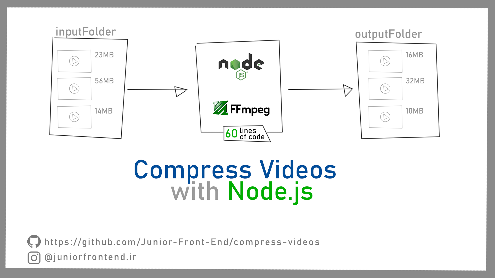

# 
کمپرسور ویدیو با FFmpeg

در تاریخ 1400.09.13 توسط [شروین](https://instagram.com/shervinjunior1995/)

## لینک های مفید

[خواندن مقاله و تماشای ویدیوی مربوطه](https://juniorfrontend.ir/%da%a9%d8%a7%d9%87%d8%b4-%d8%b3%d8%a7%db%8c%d8%b2-%d9%88%db%8c%d8%af%db%8c%d9%88%d8%8c-%d8%a8%d8%af%d9%88%d9%86-%d8%a7%d9%81%d8%aa-%da%a9%db%8c%d9%81%db%8c%d8%aa-%d8%a8%d8%a7-node-js-%d9%88-ffmpeg/)

[اینستاگرام جونیور را فالو کنید!](https://instagram.com/juniorfrontend.ir/)

## چه کار میکند؟

1. ایجاد کردن فولدر به نام inputFolder
2. ایجاد کردن فولدر به نام outputFolder
3. قرار دادن ویدیو ها در inputFolder
4. ران کردن برنامه و صبوری تا نوشتن نام تک تک ویدیو ها در کنسول (اتمام پردازش ویدیوها)

## چگونه ران شود؟

کافیست از `npm start` استفاده شود.

